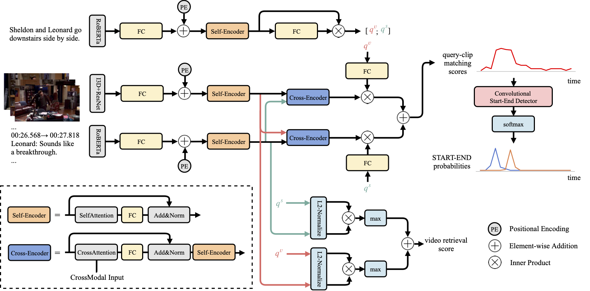
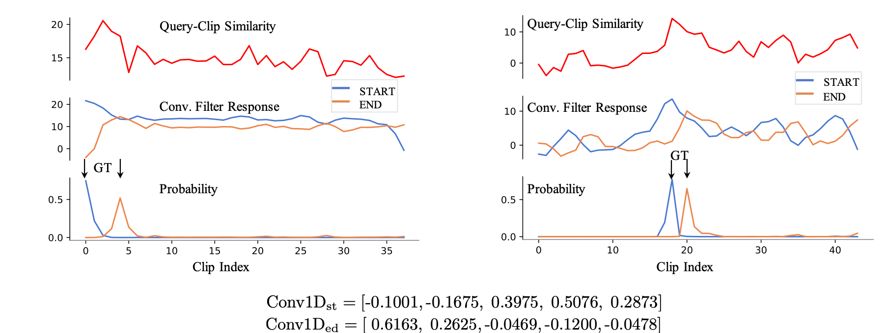

TVRetrieval
=====
PyTorch implementation of Cross-modal Moment Localization (XML), an efficient method for
video (subtitle) moment localization in corpus level. 

[TVR: A Large-Scale Dataset for Video-Subtitle Moment Retrieval](https://arxiv.org/abs/2001.09099)

[Jie Lei](http://www.cs.unc.edu/~jielei/), [Licheng Yu](http://www.cs.unc.edu/~licheng/),
[Tamara L. Berg](http://tamaraberg.com/), [Mohit Bansal](http://www.cs.unc.edu/~mbansal/)





XML achieves high efficiency by applying 1D CNNs on top of query-clip similarity scores, 
which is obtained from the inner product of independently modeled query and clip representations. 
Such design gets rid of cumbersome early fusion commonly seen in existing moment localization papers 
and is thus runs much faster. The learned convolutional filters are also interpretable, where it 
gives stronger responses on the left edges (START) and right edges (END) of the similarity 
score curve and thus detect them (see figure below). Interestingly, the learned weights 
 
and , 
as shown in the figure, are similar to the edge detectors in image processing.



## Resources
- Data: [TVR dataset](./data/)
- Website (with leaderboard): [https://tvr.cs.unc.edu/](https://tvr.cs.unc.edu/)
- Submission: [codalab evaluation server](https://competitions.codalab.org/competitions/22780)
- Related works: [TVC](https://github.com/jayleicn/TVCaption), [TVQA](https://github.com/jayleicn/TVQA), [TVQA+](https://github.com/jayleicn/TVQAplus)

## Getting started
### Prerequisites
0. Clone this repository
```
git clone https://github.com/jayleicn/TVRetrieval.git
cd TVRetrieval
```

1. Prepare feature files

Download [tvr_feature_release.tar.gz](https://drive.google.com/file/d/1j4mVkXjKCgafW3ReNjZ2Rk6CKx0Fk_n5/view?usp=sharing) (33GB). 
After downloading the feature file, extract it to the `data` directory:
```
tar -xf path/to/tvr_feature_release.tar.gz -C data
```
You should be able to see `tvr_feature_release` under `data` directory. 
It contains video features (ResNet, I3D) and text features (subtitle and query, from fine-tuned RoBERTa). 
Read the code to learn details on how the features are extracted: 
[video feature extraction](./utils/video_feature), [text feature extraction](./utils/text_feature). 

2. Install dependencies.
- Python 3.7
- PyTorch 1.4.0
- Cuda 10.1
- tensorboard
- tqdm
- h5py
- easydict

To install the dependencies use conda and pip, 
you need to have anaconda3 or miniconda3 installed first, then:
```
conda create --name tvr --file spec-file.txt
conda activate tvr 
pip install easydict
```

3. Add project root to `PYTHONPATH`
```
source setup.sh
```
Note that you need to do this each time you start a new session.

### Training and Inference
We give examples on how to perform training and inference for our Cross-modal Moment Localization (XML) model.

1. XML training
```
bash baselines/crossmodal_moment_localization/scripts/train.sh \
tvr CTX_MODE VID_FEAT_TYPE \
--exp_id EXP_ID
```
`CTX_MODE` refers to the context (video, sub, tef, etc.) we use. 
`VID_FEAT_TYPE` video feature type (resnet, i3d, resnet_i3d). 
`EXP_ID` is a name string for current run. 

Below is an example of training XML with `video_sub` (video + subtitle), 
where video feature is `resnet_i3d` (ResNet + I3D):
```
bash baselines/crossmodal_moment_localization/scripts/train.sh \
tvr video_sub resnet_i3d \
--exp_id test_run
```
This code will load all the data (~60GB) into RAM to speed up training, 
use `--no_core_driver` to disable this behavior. You can also use `--debug` before actually training the model to 
test your configuration.

By default, the model is trained with all the losses, including 
video retrieval loss  
and moment localization loss .
To train it for only the moment localization, append `--lw_neg_q 0 --lw_neg_ctx 0`.
To train it for only video retrieval, append `--lw_st_ed 0`. 

Training using the above config will stop at around epoch 60, around 4 hours on a single 2080Ti GPU server.
You should get ~2.6 for VCMR R@1, IoU=0.7 on val set. 
The resulting model and config will be saved at a dir:
`baselines/crossmodal_moment_localization/results/tvr-video_sub-test_run-*`.

2. XML inference

After training, you can inference using the saved model on val or test_public set:
```
bash baselines/crossmodal_moment_localization/scripts/inference.sh MODEL_DIR_NAME SPLIT_NAME
```
`MODEL_DIR_NAME` is the name of the dir containing the saved model, 
e.g., `tvr-video_sub-test_run-*`. 
`SPLIT_NAME` could be `val` or `test_public`. 
By default, this code evaluates all the 3 tasks (VCMR, SVMR, VR), you can change this behavior 
by appending option, e.g. `--tasks VCMR VR` where only VCMR and VR are evaluated. 
The generated predictions will be saved at the same dir as the model, you can evaluate the predictions 
by following the instructions here [Evaluation and Submission](#Evaluation-and-Submission). 

While the default inference code shown above gives you results without non-maximum suppression (NMS), 
you can append an additional flag `--nms_thd 0.5` to obtain results with NMS. Most likely you will observe
a higher R@5 score, but lower R@{10, 100} scores. For the paper, we report results with `--nms_thd 0.5` 
whenever we see a higher R@5 IoU=0.5 score on TVR val set. This strategy might not be optimal.
The examples below show the performance difference under these two conditions:
```
# with NMS (inference using --nms_thd 0.5, which we reported in the paper, last row of Table 7)
VCMR: {
    "0.5-r1": 5.28,
    "0.5-r5": 12.77,
    "0.5-r10": 17.59,
    "0.5-r100": 30.22,
    "0.7-r1": 2.62,
    "0.7-r5": 6.1,
    "0.7-r10": 8.45,
    "0.7-r100": 14.86
}

# without NMS 
VCMR: {
    "0.5-r1": 5.28,
    "0.5-r5": 11.73,
    "0.5-r10": 15.9,
    "0.5-r100": 36.16,
    "0.7-r1": 2.62,
    "0.7-r5": 6.39,
    "0.7-r10": 9.05,
    "0.7-r100": 22.47
}
``` 

Except for XML model, we also provide our implementation of [CAL](https://arxiv.org/abs/1907.12763), 
[ExCL](https://arxiv.org/abs/1904.02755) and [MEE](https://arxiv.org/abs/1804.02516). 
Their training, inference and evaluation is similar to XML. 

### Evaluation and Submission
[standalone_eval/README.md](standalone_eval/README.md)


## Citations
If you find this code useful for your research, please cite our paper:
```
@inproceedings{lei2020tvr,
  title={TVR: A Large-Scale Dataset for Video-Subtitle Moment Retrieval},
  author={Lei, Jie and Yu, Licheng and Berg, Tamara L and Bansal, Mohit},
  booktitle={Tech Report},
  year={2020}
}
```

## Acknowledgement
This research is supported by NSF Awards #1633295, 1562098, 1405822, 
DARPA MCS Grant #N66001-19-2-4031, DARPA KAIROS Grant #FA8750-19-2-1004, 
Google Focused Research Award, and ARO-YIP Award #W911NF-18-1-0336.

This code is partly inspired by the following projects: 
[transformers](https://github.com/huggingface/transformers),
[TVQAplus](https://github.com/jayleicn/TVQAplus),
[TVQA](https://github.com/jayleicn/TVQA).

## Contact
jielei [at] cs.unc.edu
